# Extract, Transform, and Load (ETL) using Power Query

## Table of Contents

- [Overview](#overview)
- [Extract](#extract)
- [Transform](#transform)

### Overview

A demo of extract, transform, and load process using Power Query in Excel or PowerBI, create a data model, and build relationships.

### Extract

1. Open PowerBI Desktop app &#8594; Select **Blank Report**
  >
  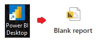
  >
2. From **Home** tab &#8594; Select **Transform data**
  >
  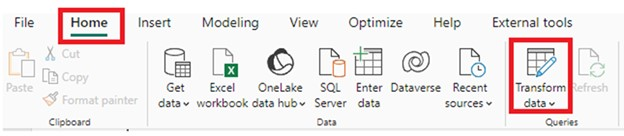
  >
3. The Power Query window will open, go to **Home** tab &#8594; **Manage Parameters**
  >
  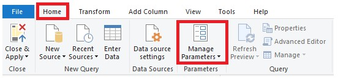
  >
4. Click **New** to create a new parameter, give it a name, description, type, and value (folder directory) then click **OK**
  >
  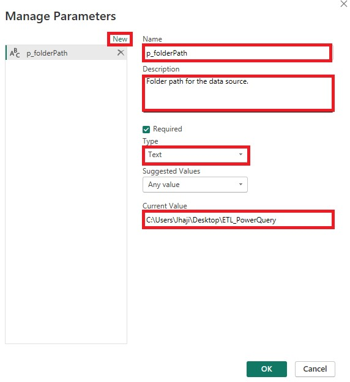
  >
5. From the Power Query Editor window, go to **Home** tab &#8594; **New Source** &#8594; **All** &#8594; **Folder** &#8594; **Connect**
  >
  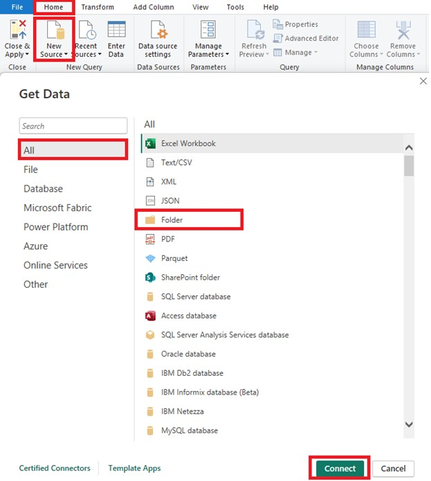
  >
6. A window will pop up, click **Browse** and locate the data source folder then click **OK**. Later we will update it with the parameter we created. Another window will pop up, click **Transform Data**.
  >
  
  >
7. Our data is now loaded as you can see on the query pane. Now we will update the folder path with the parameter we created. Click the **Gear** icon beside **Source** on the **APPLIED STEPS** pane &#8594; a window will pop up, click **ABC** drop-down and change it to **Parameter** &#8594; Select **p_folderPath** &#8594; click **OK**.
  >
   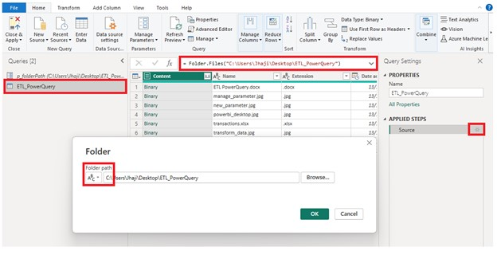
  >
8. Folder path is now updated using the dynamic parameter we created instead of the static path. Whenever we move our data source to a different directory we will only update the value on the parameter.
  >
  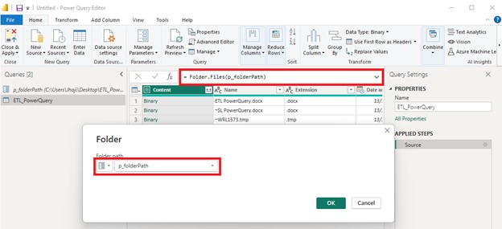
  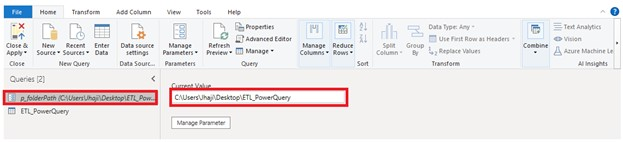
  >
9. Right-click on the query pane anywhere on the grey area, and we will create the following groups for all of our queries/tables.
  - Parameter
  - Extract
  - Transform
  - Load
  >
  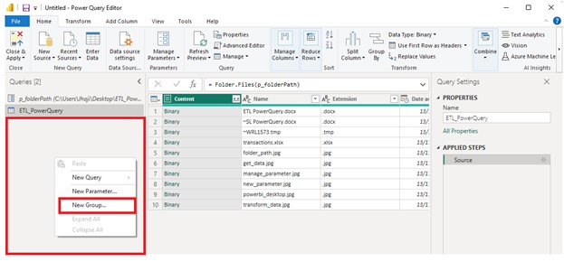
  >
10. Once all groups are created, place the **p_folderPath** in the **Parameter** folder and the **ETL_PowerQuery** table to **Extract** folder.
  >
  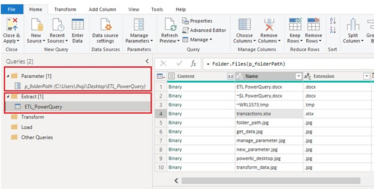
  >
11. Rename the **ETL_PowerQuery** as **extract_transactions** &#8594; go to current view and filter **Name** to **transactions.xlsx** and **Extension** to **.xlsx**. We are instructing our query to accept only the **transactions.xlsx** and **.xlsx** files in case other files are in the folder path.
  >
  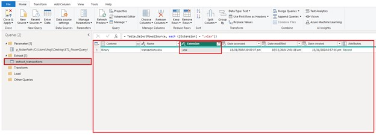
  >
12. 
  
### Transform

1. 
