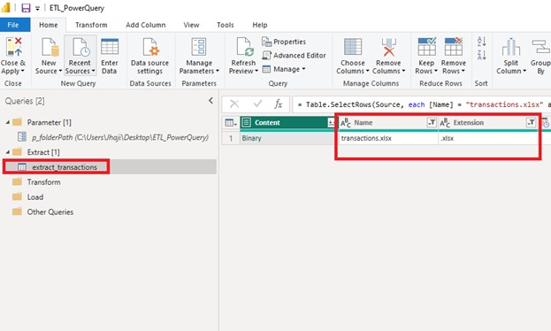
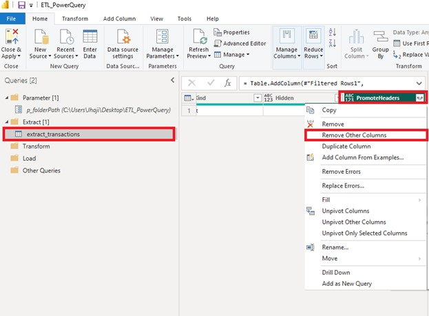
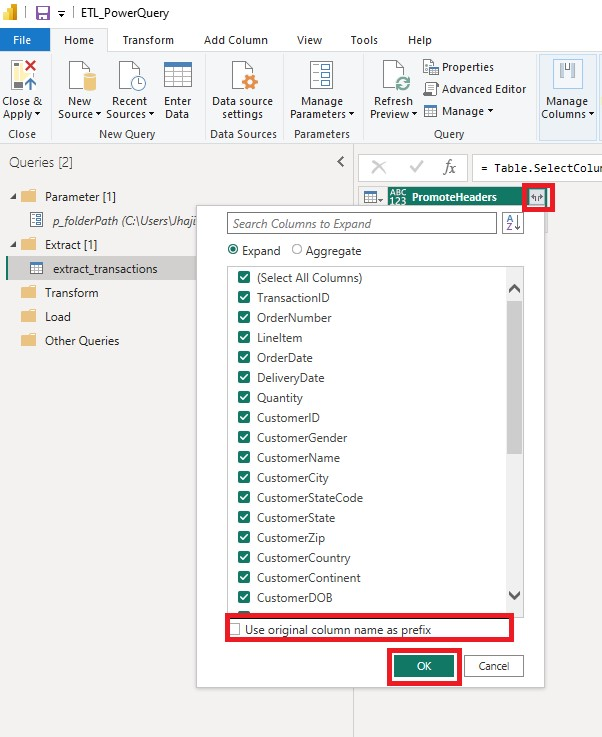
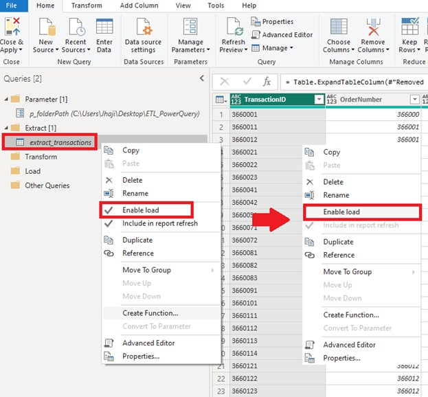
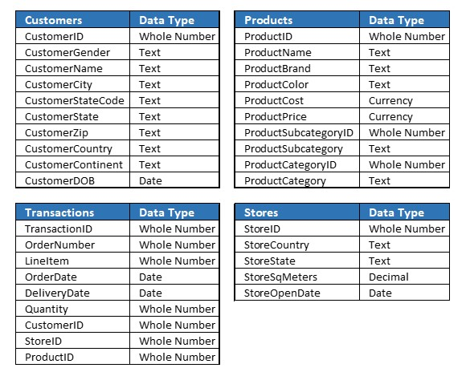

# Extract, Transform, and Load (ETL) using Power Query

## Table of Contents

- [Overview](#overview)
- [Extract](#extract)
- [Transform](#transform)
- [Load](#load)
- [Data Model and Relationships](#data-model-and-relationships)
- [Additional Reference](#additional-reference)

## Overview

A demo of extract, transform, and load process using Power Query in Excel or PowerBI, creating a Star Schema data model, and building relationships.

## Extract

1. Open PowerBI Desktop app &#8594; Select **Blank Report**
  >
  
  >
2. From **Home** tab &#8594; Select **Transform data**
  >
  
  >
3. The Power Query window will open, go to **Home** tab &#8594; **Manage Parameters**
  >
  
  >
4. Click **New** to create a new parameter, give it a name, description, type, and value (folder directory) then click **OK**
  >
  
  >
5. From the Power Query Editor window, go to **Home** tab &#8594; **New Source** &#8594; **All** &#8594; **Folder** &#8594; **Connect**
  >
  
  >
6. A window will pop up, click **Browse** and locate the data source folder then click **OK**. Later we will update it with the parameter we created. Another window will pop up, click **Transform Data**.
  >
  
  >
7. Our data is now loaded as you can see on the query pane. Now we will update the folder path with the parameter we created. Click the **Gear** icon beside **Source** on the **APPLIED STEPS** pane &#8594; a window will pop up, click **ABC** drop-down and change it to **Parameter** &#8594; Select **p_folderPath** &#8594; click **OK**.
  >
   
  >
8. Folder path is now updated using the dynamic parameter we created instead of the static path. Whenever we move our data source to a different directory we will only update the value on the parameter.
  >
  
  
  >
9. Right-click on the query pane anywhere in the grey area, and we will create the following groups for all of our queries/tables.
  - Parameter
  - Extract
  - Transform
  - Load
  >
  
  >
10. Once all groups are created, place the **p_folderPath** in the **Parameter** folder and the **ETL_PowerQuery** table to **Extract** folder.
  >
  
  >
11. Rename the **ETL_PowerQuery** as **extract_transactions** &#8594; go to current view and filter **Name** to **transactions.xlsx** and **Extension** to **.xlsx**. We are instructing our query to accept only the **transactions.xlsx** and **.xlsx** files in case other files are in the folder path.
  >
  
  >
12. Go to **Add Column** &#8594; select **Custom Column**, and give it a name &#8594; on the **Custom column formula**, add ***Excel.Workbook([Content])*** then click **OK**
  >
  
  >
13. Expand the custom column we created by clicking the arrow beside the **GetContent** column, uncheck **Use original column name as prefix** then click **OK**.
  >
  
  >
14. Filter **Kind** column to **Sheet** then click **OK**.
  >
  
  >
15. Go to **Add Column** &#8594; select **Custom Column**, give it a name &#8594; on the **Custom column formula**, add ***Table.PromoteHeaders([Data])*** then click **OK**. We are making the first row of our data as Headers.
  >
  
  >
16. Right-click on the **PromoteHeaders** column &#8594; select **Remove Other Columns**
  >
  
  >
  
  >
17. Right-click on the arrow beside **PromoteHeaders** column to expand the data &#8594; uncheck **Use original column name as prefix** then click **OK**.
  >
  
  >
18. Finally, we have done the first stage of the ETL process. All the steps we have made are recorded on the **APPLIED STEPS**, you can go back, review, and make changes if you need to.
  >
  
  >

## Transform

1. Right-click on the **extract_transform** table &#8594; uncheck **Enable load**.
  >
  
  >
2. Right-click on the extract_transactions table &#8594; select Reference &#8594; repeat 4 times, rename it, and place it in the Transform table as shown below. Make sure to uncheck **Enable load** for all the tables.
  >
  
  >
  
  >
3. Follow the steps on how to normalize data from this link: https://github.com/jhajibuganas/data_normalization. This phase of the transformation process can include:
  - Setting up data in a tabular format and organize the dataset with Rows representing records and Columns representing variables.
  - Data checking and correcting the data types.
  >
  
  >

## Load

1. Right-click on the **transform_transactions** table &#8594; select **Reference** &#8594; a new table will be created named **transform_transactions(2)**.
  >
  
  >
2. Right-click on the **transform_transactions(2)** &#8594; **Move To Group** &#8594; **Load** &#8594; Rename it by right-clicking again on the table and select **Rename** &#8594; Name it as **transactions**.
  >
  
  >
3. Repeat the step 2 above for the remaining tables. We should have the following tables in the **Load** folder.
  >
  
  >
4. The final stage of our loading process is to group our table into a Fact and Dimension table.
  - Fact Table: Stores quantitative data about the business transactions.
  - Dimension Table: Stores descriptive attributes that provide context to the Fact table.
  >
  Right-click on the **transactions** table &#8594; select **Move To Group** &#8594; **New Group** &#8594; name the group as **fact** &#8594; click **OK**.
  Repeat the process for the **customer**, **stores**, **products**, and name it as **dimension**.
  >
   
  >
   
5. 

## Data Model and Relationships
  - *In-progress*
## Additional Reference
- https://learn.microsoft.com/en-us/azure/architecture/data-guide/relational-data/etl
- https://learn.microsoft.com/en-us/power-bi/guidance/star-schema

